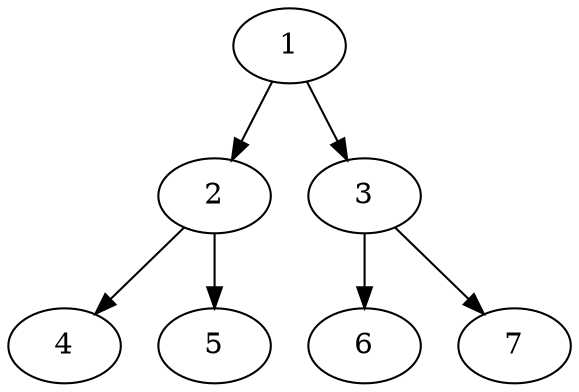
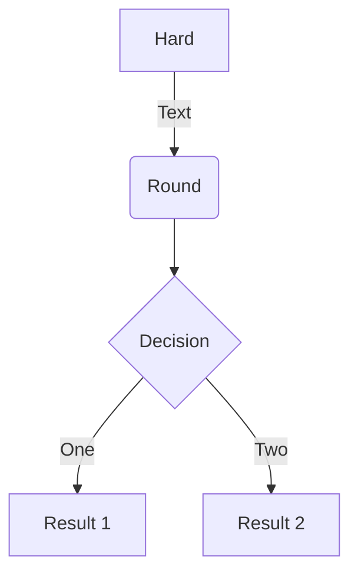
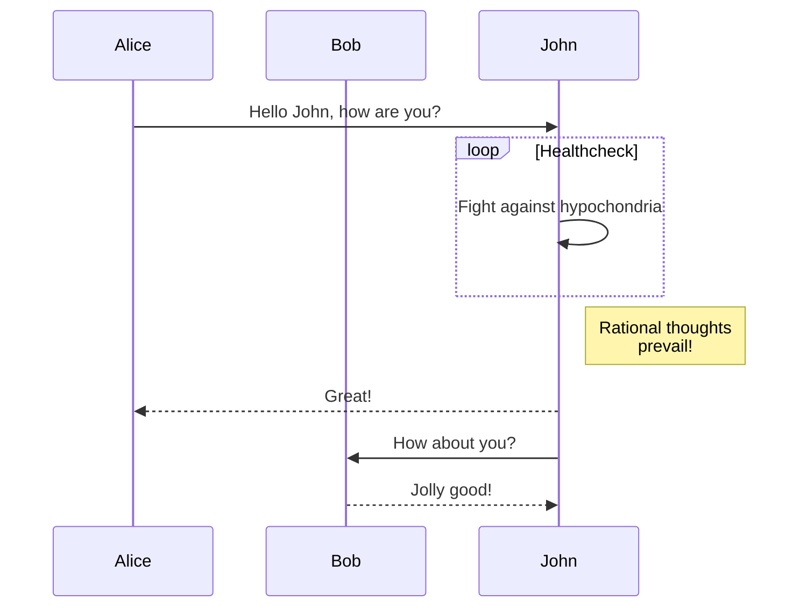
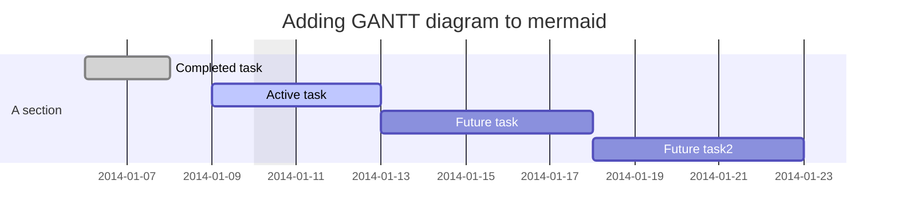
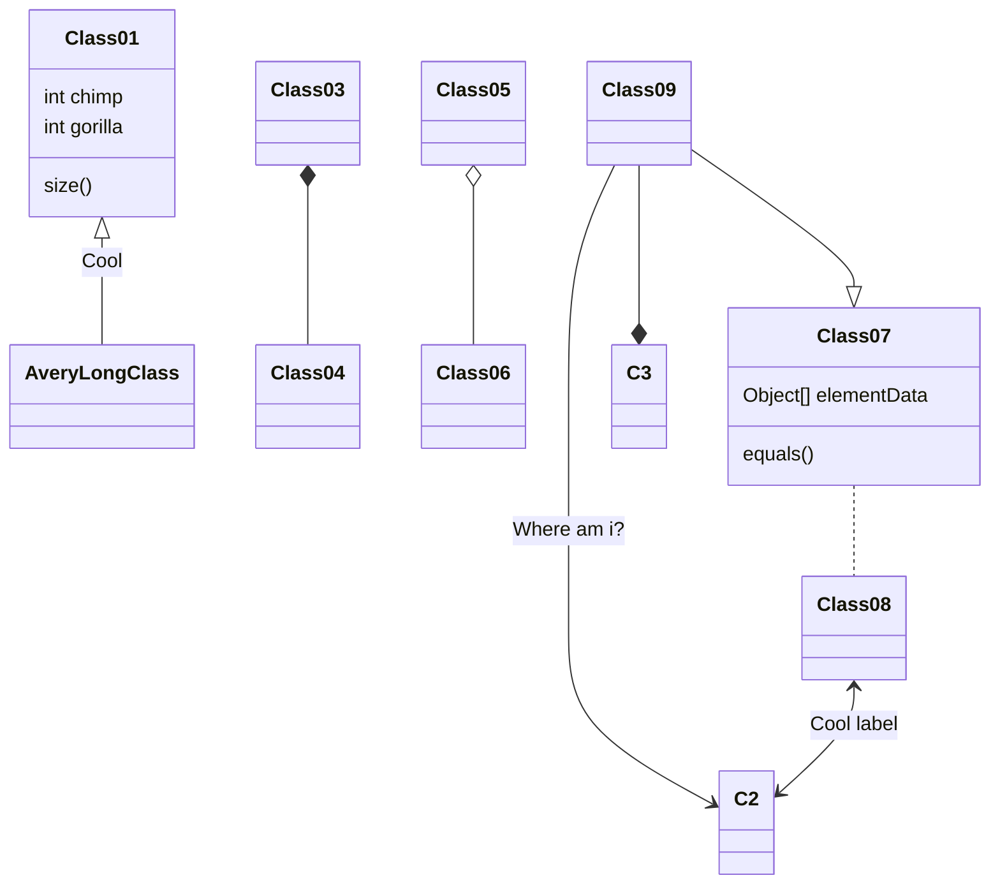
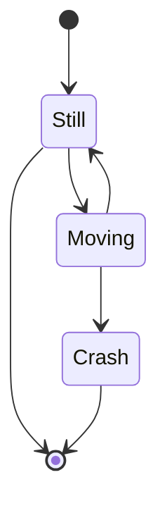
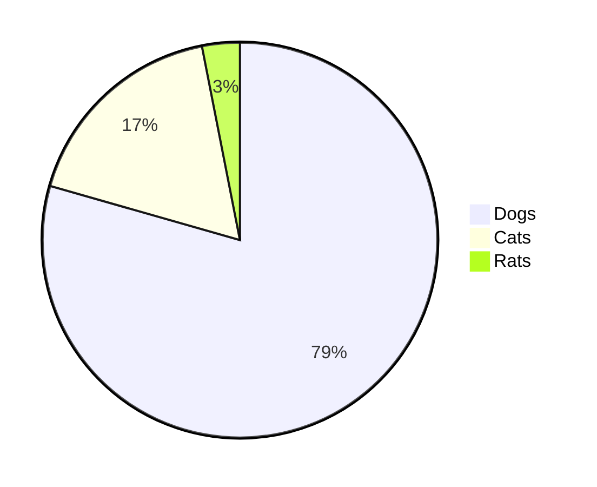
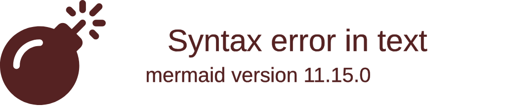
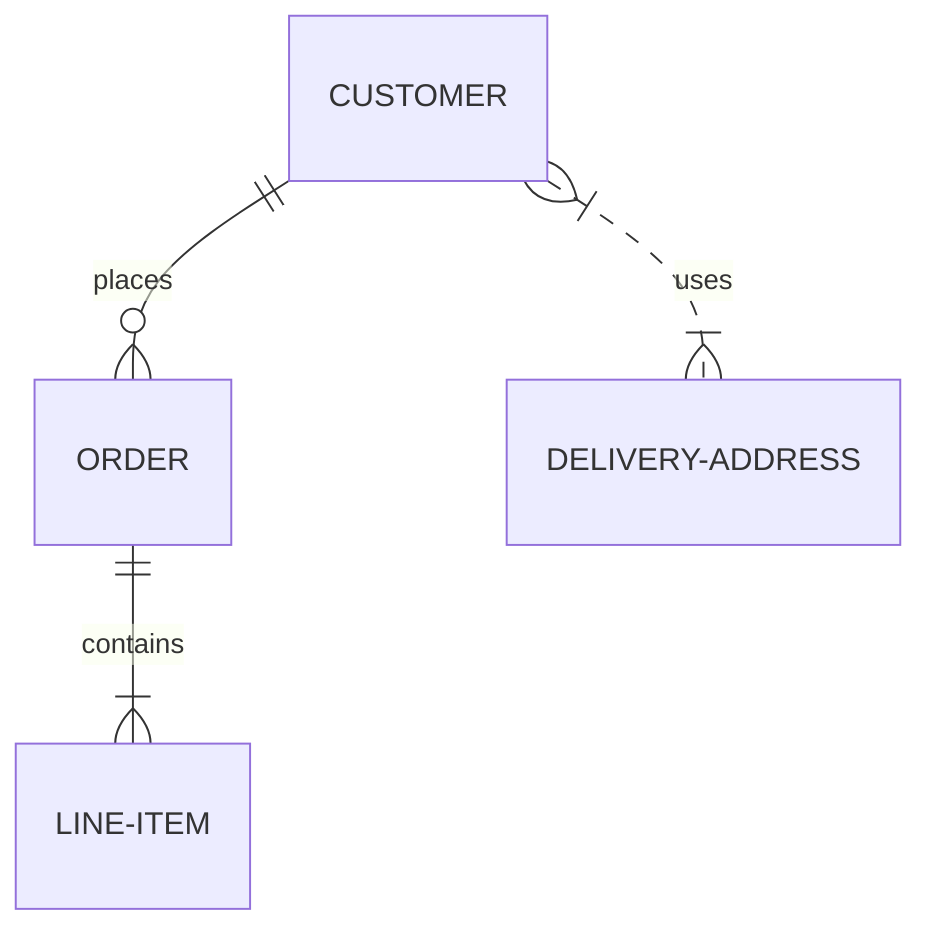
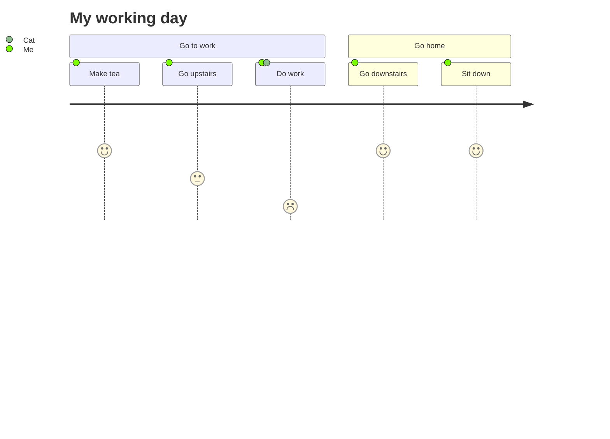

# Testing PlantUML and Mermaid Diagrams

Uses [markdown-it-textual-uml](https://github.com/manastalukdar/markdown-it-textual-uml)

Note the requirement to include the following in your template .hbs file:

```html     
<script src="https://cdn.jsdelivr.net/npm/mermaid/dist/mermaid.min.js"></script>
<script>mermaid.initialize({startOnLoad:true});</script>
```

The initialisation has to happen _after_ the DOM has loaded.

This loads the mermaid library from CDN which requires an Internet connection. Install via uibuilder to get a local version. I will look to include a local version later on.

## PlantUML

https://plantuml.com/

Note that this uses the PlantUML.com website. Data is passed to that website which converts it to an SVG.

That means that you can only use this with an internet connection.

### [Sequence Diagram](https://plantuml.com/sequence-diagram)

```plantuml
Alice -> Bob: Authentication Request
Bob --> Alice: Authentication Response

Alice -> Bob: Another authentication Request
Alice <-- Bob: Another authentication Response
```

---




---

```ditaa
+--------+   +-------+    +-------+
|        +---+ ditaa +--> |       |
|  Text  |   +-------+    |diagram|
|Document|   |!magic!|    |       |
|     {d}|   |       |    |       |
+---+----+   +-------+    +-------+
	:                         ^
	|       Lots of work      |
	+-------------------------+
```

---

## Mermaid

https://mermaid-js.github.io/mermaid/#/ ([GitHub](https://github.com/mermaid-js/mermaid))

### Flowchart



### Sequence diagram



### Gantt diagram



### Class diagram - :exclamation: experimental



### State diagram



### Pie Chart



### Git graph - :exclamation: experimental

_Careful with the formatting of this ..._



### Entity Relationship Diagram - :exclamation: experimental



### User Journey Diagram

