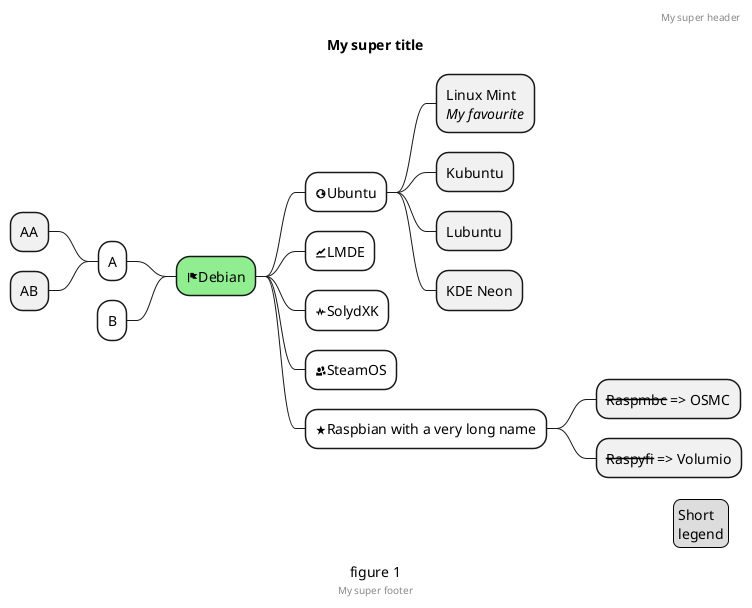

# Testing Mermaid

* [Testing Mermaid](#testing-mermaid)
  * [PlantUML](#plantuml)
    * [Sequence Diagram](#sequence-diagram)
    * [Use Case Diagram](#use-case-diagram)
    * [Class Diagram](#class-diagram)
    * [Activity Diagram - :exclamation: beta syntax](#activity-diagram---️-beta-syntax)
    * [Component Diagram](#component-diagram)
    * [State Diagram](#state-diagram)
    * [Object Diagram](#object-diagram)
    * [Deployment Diagram - :exclamation: beta](#deployment-diagram---️-beta)
    * [Timing Diagram - :exclamation: beta](#timing-diagram---️-beta)
  * [PlantUML Non-UML Diagrams](#plantuml-non-uml-diagrams)
    * [Wireframe Graphical Interface (Salt)](#wireframe-graphical-interface-salt)
    * [Archimate Diagram - :exclamation: proposal stage](#archimate-diagram---️-proposal-stage)
    * [Ditaa Diagram](#ditaa-diagram)
    * [Gantt Chart - :exclamation: beta](#gantt-chart---️-beta)
    * [Mindmap - :exclamation: beta](#mindmap---️-beta)
    * [Work Breakdown Structure (WBS) Diagram - :exclamation: beta](#work-breakdown-structure-wbs-diagram---️-beta)
    * [Mathematic with AsciiMath or JLaTeXMath notationm](#mathematic-with-asciimath-or-jlatexmath-notationm)
    * [Entity Relationship Diagram](#entity-relationship-diagram)
    * [Graphviz/DOT](#graphvizdot)
  * [Mermaid](#mermaid)
    * [Flowchart](#flowchart)
    * [Sequence diagram](#sequence-diagram-1)
    * [Gantt diagram](#gantt-diagram)
    * [Class diagram - :exclamation: experimental](#class-diagram---️-experimental)
    * [State diagram](#state-diagram-1)
    * [Pie Chart](#pie-chart)
    * [Git graph - :exclamation: experimental](#git-graph---️-experimental)
    * [Entity Relationship Diagram - :exclamation: experimental](#entity-relationship-diagram---️-experimental)
    * [User Journey Diagram](#user-journey-diagram)

Uses [markdown-it-textual-uml](https://github.com/manastalukdar/markdown-it-textual-uml)

Note the requirement to include the following in your template .hbs file:

```html     
<script src="https://cdn.jsdelivr.net/npm/mermaid/dist/mermaid.min.js"></script>
<script>mermaid.initialize({startOnLoad:true});</script>
```

The initialisation has to happen _after_ the DOM has loaded.

This loads the mermaid library from CDN which requires an Internet connection. Install via uibuilder to get a local version. I will look to include a local version later on.

See the source code for this page to view the syntax or check out the PlantUML/Mermaid documenation pages.

## PlantUML

https://plantuml.com/

Note that this uses the PlantUML.com website. Data is passed to that website which converts it to an SVG.

That means that you can only use this with an internet connection.

### [Sequence Diagram](https://plantuml.com/sequence-diagram)

```plantuml
Alice -> Bob: Authentication Request
Bob --> Alice: Authentication Response

Alice -> Bob: Another authentication Request
Alice <-- Bob: Another authentication Response
```

### [Use Case Diagram](https://plantuml.com/use-case-diagram)

```plantuml
left to right direction
skinparam packageStyle rectangle
actor customer
actor clerk
rectangle checkout {
  customer -- (checkout)
  (checkout) .> (payment) : include
  (help) .> (checkout) : extends
  (checkout) -- clerk
}

```

### [Class Diagram](https://plantuml.com/class-diagram)

```plantuml
class BaseClass

namespace net.dummy #DDDDDD {
    .BaseClass <|-- Person
    Meeting o-- Person

    .BaseClass <|- Meeting
}

namespace net.foo {
  net.dummy.Person  <|- Person
  .BaseClass <|-- Person

  net.dummy.Meeting o-- Person
}

BaseClass <|-- net.unused.Person

```

### [Activity Diagram](https://plantuml.com/activity-diagram-beta) - :exclamation: beta syntax


### [Component Diagram](https://plantuml.com/component-diagram)

```plantuml
package "Some Group" {
  HTTP - [First Component]
  [Another Component]
}

node "Other Groups" {
  FTP - [Second Component]
  [First Component] --> FTP
}

cloud {
  [Example 1]
}


database "MySql" {
  folder "This is my folder" {
    [Folder 3]
  }
  frame "Foo" {
    [Frame 4]
  }
}


[Another Component] --> [Example 1]
[Example 1] --> [Folder 3]
[Folder 3] --> [Frame 4]

```

### [State Diagram](https://plantuml.com/state-diagram)

```plantuml
scale 350 width
[*] --> NotShooting

state NotShooting {
  [*] --> Idle
  Idle --> Configuring : EvConfig
  Configuring --> Idle : EvConfig
}

state Configuring {
  [*] --> NewValueSelection
  NewValueSelection --> NewValuePreview : EvNewValue
  NewValuePreview --> NewValueSelection : EvNewValueRejected
  NewValuePreview --> NewValueSelection : EvNewValueSaved

  state NewValuePreview {
     State1 -> State2
  }

}
```

### [Object Diagram](https://plantuml.com/object-diagram)

```plantuml
object Object01
object Object02
object Object03
object Object04
object Object05
object Object06
object Object07
object Object08

Object01 <|-- Object02
Object03 *-- Object04
Object05 o-- "4" Object06
Object07 .. Object08 : some labels
```

### [Deployment Diagram](https://plantuml.com/deployment-diagram) - :exclamation: beta

```plantuml
actor foo1
actor foo2
foo1 <-0-> foo2
foo1 <-(0)-> foo2
 
(ac1) -le(0)-> left1
ac1 -ri(0)-> right1
ac1 .up(0).> up1
ac1 ~up(0)~> up2
ac1 -do(0)-> down1
ac1 -do(0)-> down2
 
actor1 -0)- actor2
 
component comp1
component comp2
comp1 *-0)-+ comp2
[comp3] <-->> [comp4]
```

### [Timing Diagram](https://plantuml.com/timing-diagram) - :exclamation: beta

```plantuml
concise "Client" as Client
concise "Server" as Server
concise "Response freshness" as Cache

Server is idle
Client is idle

@Client
0 is send
Client -> Server@+25 : GET
+25 is await
+75 is recv
+25 is idle
+25 is send
Client -> Server@+25 : GET\nIf-Modified-Since: 150
+25 is await
+50 is recv
+25 is idle
@100 <-> @275 : no need to re-request from server

@Server
25 is recv
+25 is work
+25 is send
Server -> Client@+25 : 200 OK\nExpires: 275
+25 is idle
+75 is recv
+25 is send
Server -> Client@+25 : 304 Not Modified
+25 is idle

@Cache
75 is fresh
+200 is stale
```

## PlantUML Non-UML Diagrams

### [Wireframe Graphical Interface (Salt)](https://plantuml.com/salt)


### [Archimate Diagram](https://plantuml.com/archimate-diagram) - :exclamation: proposal stage


### [Ditaa Diagram](https://plantuml.com/ditaa)

For some reason, this doesn't work with the markdown-it-textual-uml library right now.

```plantuml
@startuml
ditaa
+--------+   +-------+    +-------+
|        +---+ ditaa +--> |       |
|  Text  |   +-------+    |diagram|
|Document|   |!magic!|    |       |
|     {d}|   |       |    |       |
+---+----+   +-------+    +-------+
    :                         ^
    |       Lots of work      |
    +-------------------------+
@enduml
```

### [Gantt Chart](https://plantuml.com/gantt-diagram) - :exclamation: beta


### [Mindmap](https://plantuml.com/mindmap-diagram) - :exclamation: beta

Note that there are lots of other options for creating mindmaps, check the linked docs



### [Work Breakdown Structure (WBS) Diagram](https://plantuml.com/wbs-diagram) - :exclamation: beta


### [Mathematic with AsciiMath or JLaTeXMath notationm](https://plantuml.com/ascii-math)


### [Entity Relationship Diagram](https://plantuml.com/ie-diagram)


### [Graphviz/DOT](https://plantuml.com/ditaa#dot)

PlantUML also supports Graphviz's DOT notation.

Note that you can use <code>&#96;&#96;&#96;dot</code> instead of <code>&#96;&#96;&#96;plantuml</code> here.


---

## Mermaid

https://mermaid-js.github.io/mermaid/#/ ([GitHub](https://github.com/mermaid-js/mermaid))

### Flowchart


### Sequence diagram


### Gantt diagram

```mermaid
gantt
    dateFormat  YYYY-MM-DD
    title Adding GANTT diagram to mermaid
    excludes weekdays 2014-01-10

    section A section
    Completed task            :done,    des1, 2014-01-06,2014-01-08
    Active task               :active,  des2, 2014-01-09, 3d
    Future task               :         des3, after des2, 5d
    Future task2               :         des4, after des3, 5d
```

### Class diagram - :exclamation: experimental

```mermaid
classDiagram
    Class01 <|-- AveryLongClass : Cool
    Class03 *-- Class04
    Class05 o-- Class06
    Class07 .. Class08
    Class09 --> C2 : Where am i?
    Class09 --* C3
    Class09 --|> Class07
    Class07 : equals()
    Class07 : Object[] elementData
    Class01 : size()
    Class01 : int chimp
    Class01 : int gorilla
    Class08 <--> C2: Cool label
```

### State diagram

```mermaid
stateDiagram
    [*] --> Still
    Still --> [*]
    Still --> Moving
    Moving --> Still
    Moving --> Crash
    Crash --> [*]
```

### Pie Chart

```mermaid
pie
    "Dogs" : 386
    "Cats" : 85
    "Rats" : 15
```

### Git graph - :exclamation: experimental

_Careful with the formatting of this ..._

```mermaid
gitGraph:
options
{
    "nodeSpacing": 150,
    "nodeRadius": 10
}
end
commit
branch newbranch
checkout newbranch
commit
commit
checkout master
commit
commit
merge newbranch

```

### Entity Relationship Diagram - :exclamation: experimental

```mermaid
erDiagram
    CUSTOMER ||--o{ ORDER : places
    ORDER ||--|{ LINE-ITEM : contains
    CUSTOMER }|..|{ DELIVERY-ADDRESS : uses
```

### User Journey Diagram

```mermaid
journey
    title My working day
    section Go to work
      Make tea: 5: Me
      Go upstairs: 3: Me
      Do work: 1: Me, Cat
    section Go home
      Go downstairs: 5: Me
      Sit down: 5: Me
```