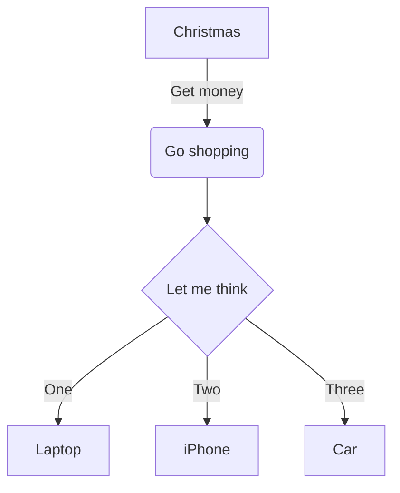

# Common Mark Test file

## TOC

Requires markdown-it extension `markdown-it-anchor` and `markdown-it-table-of-contents`

```markdown
[[toc]]
```

[[toc]]

## Symbols

`&copy;` &copy;

## Headers

```markdown
This is an H1
=============

This is an H2
-------------
```

This is an H1
=============

This is an H2
-------------

```markdown
#### This is an H4

##### This is an H5
```

#### This is an H4

##### This is an H5

## Blockquotes

```markdown
> This is the first level of quoting.
>
> > This is nested blockquote.
>
> Back to the first level.
```

> This is the first level of quoting.
>
> > This is nested blockquote.
>
> Back to the first level.

## Lists

Checkboxes require markdown-it plugin `markdown-it-imsize`

```markdown
+   Red
    - Red a
+   Green
+   Blue
1.  Bird
    1. Bird.1
2.  McHale
3.  Parish

- [ ] Check 1 - requires an extension to markdown-it
- [x] Check 2
```

+   Red
    - Red a
+   Green
+   Blue
1.  Bird
    1. Bird.1
2.  McHale
3.  Parish


- [ ] Check 1
- [x] Check 2

### Definition List

```markdown
<dl>
    <dt>List Term 1</dt>
    <dd>Definition 1a</dd>
    <dd>Definition 1b</dd>
    <dt>List Term 2</dt>
    <dd>Definition 2</dd>
</dl>
```

<dl>
    <dt>List Term 1</dt>
    <dd>Definition 1a</dd>
    <dd>Definition 1b</dd>
    <dt>List Term 2</dt>
    <dd>Definition 2</dd>
</dl>

## Span Elements

### Line breaks

```markdown
Some text<br>more text.
```

Some text<br>more text.

### Links

```markdown
This is [an example](http://example.com/ "Title") inline link.
```

This is [an example](http://example.com/ "Title") inline link.

```markdown
This is [an example][id] reference-style link.

[id]: http://example.com/  "Optional Title Here"
```

This is [an example][id] reference-style link.

[id]: http://example.com/  "Optional Title Here"

```markdown
<http://example.com/> Automatic Links
```

<http://example.com/> Automatic Links

```markdown
http://example.com/ Implied Links
```

http://example.com/ Implied Links


#### Link to heading

Requires markdown-it extension `markdown-it-anchor`

```markdown
This is [a link to a heading](#headers).
```

This is [a link to a heading](#headers).

### Emphasis

```markdown
*single asterisks* :: _single underscores_  :: **double asterisks** :: __double underscores__
```

*single asterisks* :: _single underscores_ :: **double asterisks**  :: __double underscores__

```markdown
Cross-out information using ~~double tildes~~.
```

Cross-out information using ~~double tildes~~.

```markdown
<u>underline</u>rs
```

<u>underline</u>rs

```markdown
==marked==
```

==marked== (requires markdown-it extension `markdown-it-mark`)

### Inline Code

```markdown
`&#8212;` is the decimal-encoded equivalent of `&mdash;`.
```

`&#8212;` is the decimal-encoded equivalent of `&mdash;`.

### Keyboard

```markdown
Some keyboard [[abc]] text
```

Some keyboard [[abc]] text

### Images

#### Standard style

Image size parameter requires markdown-it extension `markdown-it-imsize`

```markdown

```


#### Reference Style

NOTE: Image size extension does not work with reference styles

```markdown
![Alt text][id1]

[id1]: images/Annotation_2019-07-05_223322.jpg  "Optional title attribute"
```

![Alt text][id1]

[id1]: images/Annotation_2019-07-05_223322.jpg  "Optional title attribute"

### Emoji

```markdown
Sometimes you want to :monkey: around a bit and add some :star2: to your :speech_balloon:. Well we have a gift for you:

:zap: You can use emoji anywhere GFM is supported. :v:

You can use it to point out a :bug: or warn about :speak_no_evil: patches. And if someone improves your really :snail: code, send them some :birthday:. People will :heart: you for that.

If you are new to this, don't be :fearful:. You can easily join the emoji :family:. All you need to do is to look up one of the supported codes.

Consult the [Emoji Cheat Sheet](https://www.emojicopy.com) for a list of all supported emoji codes. :thumbsup:
```

Sometimes you want to :monkey: around a bit and add some :star2: to your :speech_balloon:. Well we have a gift for you:

:zap: You can use emoji anywhere GFM is supported. :v:

You can use it to point out a :bug: or warn about :speak_no_evil: patches. And if someone improves your really :snail: code, send them some :birthday:. People will :heart: you for that.

If you are new to this, don't be :fearful:. You can easily join the emoji :family:. All you need to do is to look up one of the supported codes.

Consult the [Emoji Cheat Sheet](https://www.emojicopy.com) for a list of all supported emoji codes. :thumbsup:

### Spans

```markdown
<span style="color:red">This is spanned</span>
```

<span style="color:red">This is spanned</span>

### Abbreviations

```markdown
<p>The <abbr title="Hyper Text Markup Language">HTML</abbr> specification
is maintained by the <abbr title="World Wide Web Consortium">W3C</abbr>.</p>
```

<p>The <abbr title="Hyper Text Markup Language">HTML</abbr> specification
is maintained by the <abbr title="World Wide Web Consortium">W3C</abbr>.</p>

### Sub- and Super-script

Requires markdown-it extension `markdown-it-sub` and `markdown-it-sup`

```markdown
Subscript: 'H~2~0', Superscript: 29^th^
```

Subscript: 'H~2~0', Superscript: 29^th^

## Tables

```markdown
| header 1 | header 2 | header 3 |
| ---      |  ------  |----------|
| cell 1   | cell 2   | cell 3   |
| cell 4 | cell 5 is longer | cell 6 is much longer than the others, but that's ok. It will eventually wrap the text when the cell is too large for the display size. |
| cell 7   |          | cell <br> 9 |
```

| header 1 | header 2 | header 3 |
| ---      |  ------  |----------|
| cell 1   | cell 2   | cell 3   |
| cell 4 | cell 5 is longer | cell 6 is much longer than the others, but that's ok. It will eventually wrap the text when the cell is too large for the display size. |
| cell 7   |          | cell <br> 9 |

---

## Custom Attributes

Requires extension to markdown-it. `@gerhobbelt/markdown-it-attrs`

NOTE: Only classes work attached in-line, everything else applies to the block and must go at the end of the line

```markdown
##### header {.green #id45}
some text {.pl-ii with=attrs and="attrs with space"}

paragraph *style me*{.red} more{#id46} green-text{style="color:green;background-color:pink"}
```

##### header {.green #id45}
some text {.pl-ii with=attrs and="attrs with space"}

paragraph *style me*{.red} more{#id46} green-text{style="color:green;background-color:pink"}

---

## Footnotes

Requires extension to markdown-it. `@gerhobbelt/markdown-it-footnote`

```markdown
You can add footnotes to your text as follows.[^1]

[^1]: This is my awesome footnote (later in file).
```

You can add footnotes to your text as follows.[^1]

[^1]: This is my awesome footnote (later in file).

----

## Embedded html markup


```markdown
<table>
    <tr>
        <td>Foo</td>
    </tr>
</table>
```

<table>
    <tr>
        <td>Foo</td>
    </tr>
</table>

---

## Code playgrounds

Requires markdown-it addin `markdown-it-playground`

```markdown
@[jsfiddle](http://jsfiddle.net/rykeller/y4848ak7/8/embedded/html,css,result/)

@[codepen](http://codepen.io/Yakudoo/embed/YXxmYR/?height=265&amp;theme-id=0&amp;default-tab=js,result&amp;embed-version=2)
```

@[jsfiddle](http://jsfiddle.net/rykeller/y4848ak7/8/embedded/html,css,result/)

@[codepen](http://codepen.io/Yakudoo/embed/YXxmYR/?height=265&amp;theme-id=0&amp;default-tab=js,result&amp;embed-version=2)


## Diagrams (Mermaid)

```markdown
    ```mermaid
    graph TD;
    A-->B;
    A-->C;
    B-->D;
    C-->D;
    ```
```



## Syntax Highlighting

Requires markdown-it extension `markdown-it-prism`. Uses PrismJS with the Dark theme.

### Examples

#### HTML/Handlebars

```handlebars
<!DOCTYPE html>
<html lang="en">
    <head>
        <meta charset="utf-8">
        <title>{{frontMatter.title}}</title>
        <link rel="stylesheet" href="{{stylesheet}}">
        <link rel="stylesheet" href="{{prismstyles}}">
    </head><body>
        {{{content}}}
        <hr>
        <h2>Meta Data</h2>
        <dl>
            <dt>Stylesheet</dt> <dd>{{stylesheet}}</dd>
            <dt>Prism Styles (Syntax Highlighting)</dt> <dd>{{prismstyles}}</dd>
            <dt>Template</dt> <dd>{{template}}</dd>
            <dt>Date/Time Modified</dt> <dd>{{mtime}}</dd>
        </dl>

        <h2>Front Matter</h2>
        <pre>{{fmPre}}</pre>
    </body>
</html>
```

#### JavaScript

```javascript
var Prism = require('prismjs');

// The code snippet you want to highlight, as a string
var code = "var data = 1;";

// Returns a highlighted HTML string
var html = Prism.highlight(code, Prism.languages.javascript, 'javascript');
```

#### Windows Command Line

Without language definition:

```
λ  npm install markdown-it-prismnpm WARN @gerhobbelt/markdown-it-attrs@2.3.2-10 requires a peer of @gerhobbelt/markdown-it@~8.4.2-24 but none is installed. You must install peer dependencies yourself.

+ markdown-it-prism@2.0.2
added 7 packages from 3 contributors and audited 311 packages in 4.841s
```

Defined as `batch`

```batch
λ  npm install markdown-it-prismnpm
WARN @gerhobbelt/markdown-it-attrs@2.3.2-10 requires a peer of @gerhobbelt/markdown-it@~8.4.2-24 but none is installed. You must install peer dependencies yourself.

+ markdown-it-prism@2.0.2
added 7 packages from 3 contributors and audited 311 packages in 4.841s
```
